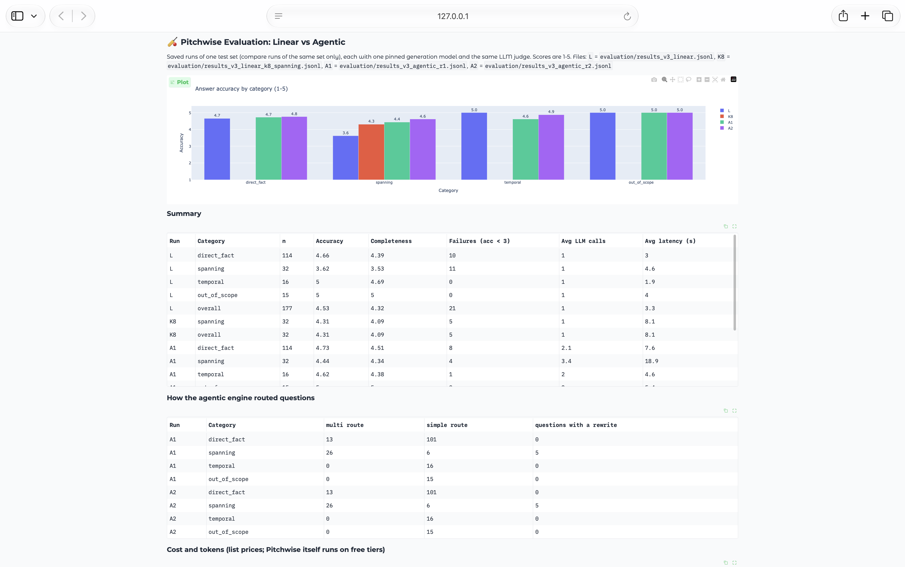
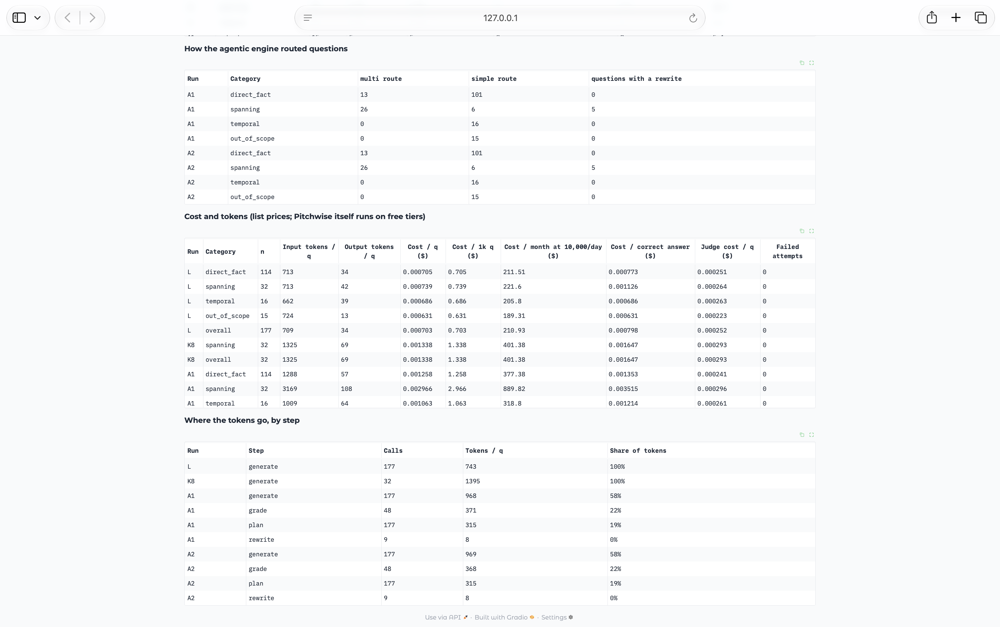

# EVAL_RESULTS.md — Pitchwise

A summary of the evaluation work behind Pitchwise, in plain terms. For the
full reasoning behind every decision referenced here, see
[`DECISIONS.md`](./DECISIONS.md).

---

## How this RAG pipeline was validated, and how it improved

Two rounds of validation happened, at two different points in the build,
using two different levels of rigor — worth being upfront about that rather
than implying uniform treatment throughout.

### Round 1 — Chunking & embedding model (small-scale, manual)

Before the full evaluation harness existed, chunking strategy and embedding
model choice were validated with a hand-verified 8-query test set run
against 4 embedding models. This surfaced a real bug: three of four models
failed to answer "What is Don Bradman's exact career Test batting average?"
correctly — not because of model quality, but because the knowledge base's
"Career Statistics" section didn't repeat Bradman's name, making the chunk
ambiguous once embedded independently. Restructuring all 17 documents so
every section self-anchors with its subject's name fixed this across every
model tested.

**Full reasoning:** [`DECISIONS.md` D-001, D-002, D-003](./DECISIONS.md)

### Round 2 — Full evaluation harness (104 questions, systematic)

A proper evaluation harness was then built: **104 test questions** across
four categories, each checked on two independent metrics — **retrieval
quality** (MRR, nDCG, keyword coverage) and **answer quality** (an
independent LLM judge scoring accuracy, completeness, and relevance, 1–5).

| Category | Count | What it tests |
|---|---|---|
| `direct_fact` | 59 | Single, unambiguous facts |
| `spanning` | 20 | Questions needing 2+ facts combined |
| `temporal` | 10 | Recency-sensitive / retirement-status questions |
| `out_of_scope` | 15 | Questions the knowledge base does **not** cover — tests whether the system correctly declines rather than hallucinates |

---

## The headline finding: a real grounding gap, found and closed

Manual testing surfaced a case where Pitchwise confidently answered a
question about cricket nicknames using general model knowledge, not its own
knowledge base — despite an explicit system-prompt instruction to decline
when unsure. Running the full harness confirmed this wasn't a one-off:

| | `out_of_scope` accuracy | Overall accuracy (n=104) |
|---|---|---|
| **Before fix** | **3.3 / 5** | 4.6 / 5 |
| **After fix — Run 1** | **5.0 / 5** | — |
| **After fix — Run 2** | **5.0 / 5** | — |

The system prompt was rewritten from a single soft suggestion ("if you
don't know, say so") into explicit, repeated grounding rules — a required
exact refusal phrase, and an instruction not to name any entity absent from
the retrieved context. The fix was verified **twice, independently** — not
just once — since LLM outputs carry natural run-to-run variance, and a
result that holds twice is real evidence, not a lucky run.

**Full reasoning:** [`DECISIONS.md` C-003](./DECISIONS.md)

---

## An honest side effect, also found by the same two runs

The stricter grounding prompt didn't come free. The `spanning` category
(compound/comparison questions) dipped slightly across the same two runs
(~4.35 → ~4.10). Inspecting the actual failures split them into two
different problems:

- **Genuine retrieval gaps** — some compound questions need more than the
  default 4 retrieved chunks to answer fully; the model now correctly
  declines instead of guessing, which is *correct* behavior given
  incomplete context, but means real answers are being missed.
- **Over-conservative refusal** — a couple of cases where the retriever
  found everything needed, but the model still declined simple combination
  or inference over the retrieved facts. This is a prompt-strictness side
  effect, not a retrieval problem — raising `k` won't fix it. *(October
  update: one of these, the powerplay question, turned out to be a correct
  refusal; the fact is not in the knowledge base. See
  [`DECISIONS.md` C-004](./DECISIONS.md).)*

This is a genuinely useful finding, not a flaw to hide: it shows the
evaluation harness catching a second-order effect of its own first fix, and
gives a concrete, evidence-backed next step rather than a vague "could be
improved."

**Full reasoning, including the next step already built (`compare_k.py`):**
[`DECISIONS.md` D-007](./DECISIONS.md)

---

## v2: linear vs agentic engine (October 2026)

v2 added a LangGraph agentic engine (plan, grade, capped rewrite) beside the
v1 linear pipeline ([`DECISIONS.md` D-009](./DECISIONS.md)). It was measured
on the same 104 questions, in the same week, with one answer model pinned
for every run (qwen3.8-27b on Groq, no fallback for the answer step) and the
same judge (Gemini 3.5 Flash Lite) ([`DECISIONS.md` D-010](./DECISIONS.md)).
In the agentic runs the routing calls (plan, grade, rewrite) were not pinned
and could fall back to another model when qwen was rate-limited; this was
found after the runs and fixed ([`DECISIONS.md` C-005](./DECISIONS.md)).

Question numbers (Q66 and so on) are line numbers in
`evaluation/tests.jsonl`, counting from 1.

- **L1**: linear engine, one run (the baseline)
- **A1, A2**: agentic engine, two independent runs

### Answer accuracy by category (1-5)

| Category | n | L1 linear | A1 agentic | A2 agentic |
|---|---|---|---|---|
| `direct_fact` | 59 | 5.0 | 5.0 | 5.0 |
| `spanning` | 20 | **4.2** | **5.0** | **5.0** |
| `temporal` | 10 | 4.6 | 4.6 | 4.5 |
| `out_of_scope` | 15 | 4.7 | 5.0 | 4.9 |
| Overall | 104 | 4.8 | 5.0 | 4.9 |


*From `evaluation/compare_runs.py`, which reads the saved results files and
makes no LLM calls.*

The pass rule was fixed before the runs: `spanning` at least 0.3 above the
baseline in **both** agentic runs, `direct_fact` not below 4.9, at most one
`out_of_scope` failure per run, and `temporal` within 0.3 of the baseline.
Both runs pass.

**Not measured in v2:** a k=8 linear control was planned
([`DECISIONS.md` D-009](./DECISIONS.md)) but not run, so these results show
the agentic engine against the default k=4 only. It was run in v3, below.

### Where the spanning gain came from

L1 failed 4 of the 20 `spanning` questions (each scored 1); A1 and A2 failed
none. The eval's retrieval metrics always score the v1 retriever, so
`evaluation/mechanism.py` re-ran those 4 questions through the agentic engine
and measured keyword coverage on the context the answer was actually
generated from:

| Q | Question (short) | v1 coverage | Agentic coverage | Why it was fixed |
|---|---|---|---|---|
| 66 | The 7,000-run / 200-wicket players | 0% | 100% | Planner's standalone rewrite retrieved the right chunk |
| 67 | World Cup vs T20 World Cup founding years | 50% | 100% | Split into two sub-queries |
| 76 | Ashes vs World Test Championship format | 50% | 100% | Split into two sub-queries |
| 79 | The "Fab Four" nations | 100% | 100% | Not the engine: identical context; the model answered instead of refusing |

**3 of the 4 fixes come from retrieval**, which is what the engine was built
to change. The fourth (Q79) is an over-cautious refusal in the generation
step; the same context was refused again by a different model in the
mechanism check, so it is counted as model variance, not as an engine gain.

### What it costs

| | Linear | Agentic (A2) |
|---|---|---|
| LLM calls per question, average | 1 | 2.2 |
| LLM calls per `spanning` question | 1 | 3.2 |
| `spanning` questions routed to `multi` | n/a | 16 of 20 |
| Questions that used a rewrite | n/a | 2 of 104 (2 of 104 in A1 too) |
| Average latency per question, as recorded | 1.8 s | 7.1 s (A1), 2.8 s (A2) |

Simple questions take 2 calls (plan + generate) and skip grading, which is
why `direct_fact` stayed at 5.0.

**Latency is reported but not used as a result.** All runs shared one free
Groq quota, and the agentic runs were slowed by rate-limit waits as the
daily token limit filled up: the same engine averaged 7.1 s in A1 and 2.8 s
in A2. LLM calls per question are the stable measure of cost; a real
latency comparison needs a paid tier or a dedicated benchmark.

### Remaining failures, reported as found

- **Q83 (temporal), failed in all three runs.** "Has Ben Stokes retired from
  any international format?" The answer is in the knowledge base, but under
  a `## Personal` heading that never mentions retirement, so neither engine
  retrieves it. The agentic engine routes it as `simple`, which skips
  grading, so it never notices the gap. This is a knowledge-base structure
  issue of the kind D-003 fixed elsewhere, and is part of v3.
- **Q90 (out_of_scope), partial in A2 (scored 3).** Asked about "Master
  Blaster, Little Master, Chase Master", A2 attributed "Chase Master" to
  Tendulkar; the knowledge base says Kohli. A1 answered it correctly from
  context, and L1 answered it from general knowledge. Part of the question
  *is* in the knowledge base, so it is also mislabelled as out of scope; the
  test set will be corrected in v3.
- **Q78 was not a failure.** D-007 had filed the powerplay question as an
  over-cautious refusal. The agentic grader showed the ODI powerplay length
  is simply not in the knowledge base, so refusing was correct
  ([`DECISIONS.md` C-004](./DECISIONS.md)). In A2 the engine answered the
  part it could (T20I: 6 overs) and said the ODI figure was not available.

### Reproduce

```bash
uv run python -m evaluation.eval --pin-model --results evaluation/results_linear_oct.jsonl
uv run python -m evaluation.eval --engine agentic --pin-model --results evaluation/results_agentic_r1.jsonl
uv run python -m evaluation.eval --engine agentic --pin-model --results evaluation/results_agentic_r2.jsonl
uv run python -m evaluation.mechanism            # final-context coverage for Q66, Q67, Q76, Q79
uv run python -m evaluation.compare_runs         # dashboard comparing the saved runs, no LLM calls
```

---

## v3: a 150-document knowledge base, with cost (October 2026)

v3 grew the knowledge base from 17 documents (81 chunks) to 150 documents
(3,106 chunks) by adding 133 Wikipedia articles
([`DECISIONS.md` D-014](./DECISIONS.md)), and measured both engines on a new
177-question test set: 89 questions carried over unchanged from v2 and 88 new
or re-labelled ones. Every LLM call now records its tokens and list-price
cost (D-012), and every answer is traced in Langfuse (D-013).

Four runs, all with the same pinned answer model (qwen3.8-27b on Groq's
free tier, D-016) and the same judge (Gemini 3.5 Flash Lite):

- **L**: linear engine, k=4 (the v1 pipeline)
- **K8**: linear engine, k=8, on the 32 `spanning` questions only (the
  control D-009 planned and D-017 ran)
- **A1, A2**: agentic engine, two independent runs. A1's five questions
  that used a rewrite were re-run after the rewrite-loop fix
  ([`DECISIONS.md` C-010](./DECISIONS.md)); their scores did not change.

**One correction to the judge's scores.** The judge gave 5 out of 5 to five
answers that were the fixed refusal sentence on a question the knowledge
base does answer (2 in L, 3 in A2; for example, the first Women's World Cup
captain, Rachael Heyhoe Flint, is in the knowledge base). The same refusal
to the same question was scored 1 in another run. These five are counted as
wrong (accuracy 1) in every table below, and the as-judged figure is given
beside it where it differs ([`DECISIONS.md` C-011](./DECISIONS.md)). The
results files keep the judge's original scores.

### Answer accuracy by category (1-5)

| Category | n | L (k=4) | K8 (k=8) | A1 agentic | A2 agentic |
|---|---|---|---|---|---|
| `direct_fact` | 114 | 4.62 (as judged 4.66) | – | 4.73 | 4.69 (4.76) |
| `spanning` | 32 | 3.62 | 4.31 | **4.44** | **4.50** (4.62) |
| `temporal` | 16 | 4.75 (5.00) | – | 4.62 | 4.88 |
| `out_of_scope` | 15 | 5.00 | – | 5.00 | 5.00 |
| Overall | 177 | 4.49 (4.53) | – | 4.69 | 4.70 (4.77) |

With the correction, the two agentic runs agree to within 0.06 in every
category and 0.01 overall.



*From `evaluation/compare_runs.py` (no LLM calls). The dashboard shows the
judge's scores as recorded in the results files, so it reads 4.6 for A2 on
`spanning` and 5.0 for L on `temporal`; the table above counts the five
wrong refusals of C-011 as wrong. Its latency column includes free-tier
rate-limit waits and is not a result.*

### What scale did

**It did not hurt the questions v2 already answered.** On the 89 questions
carried over unchanged, the linear engine scored 4.82 in v2 and 4.82 in v3.
The lower v3 average comes from the new questions, which ask about the
Wikipedia content: linear scored 4.15 on them with 19 failures, the agent
4.49 with 11 in both runs. Most of those failures (15 of 19 for linear,
9 of 11 for the agent) are refusals where retrieval missed the fact.

Single questions did get harder. "What is Virat Kohli's highest Test
score?" scored 5 in v2 and 1 in every v3 run: its keyword coverage fell from
100% to 33% once near-duplicate Wikipedia chunks competed for the top 4
places.

### Does the agent beat simply retrieving more?

D-009 named raising k as the cheapest alternative to the agent; v2 never ran
it. On the 32 `spanning` questions:

| | L (k=4) | K8 (k=8) | A1 | A2 |
|---|---|---|---|---|
| Accuracy | 3.62 | 4.31 | 4.44 | 4.50 |
| Correct answers (score 4 or 5) | 21 | 26 | 27 | 28 |
| Tokens per question | 755 | 1,395 | 3,277 | 3,265 |
| LLM calls per question | 1 | 1 | 3.4 | 3.4 |
| List-price cost per 1,000 correct answers | $1.13 | $1.65 | $3.52 | $3.43 |

**Raising k recovers most of the gain.** k=8 lifts `spanning` from 3.62 to
4.31 at 1.8 times the tokens of k=4. **The agent is ahead of k=8 in both
runs**, by 0.13 and 0.19 (one or two more correct answers out of 32), at
about 2.3 times k=8's tokens, so each correct compound answer costs about
twice as much. The two approaches fix different questions: k=8 fixed the
Ashes vs World Test Championship question, which the agent answered only
partly in A1; the agent fixed the Kumble vs Muralitharan and Big Bash vs
SA20 comparisons, which k=8 still missed.

The verdict: on this knowledge base, the agent's gain over simply
retrieving more is small and consistent, and it costs about twice as much
per correct compound answer. Raising k is the better first step; the agent
earns its place where compound questions matter more than cost. k=8 was run
once, so its 4.31 carries run-to-run variance of its own.

### What it costs

| | Linear (k=4) | Agentic (A1 / A2) |
|---|---|---|
| Tokens per question | 743 | 1,662 / 1,660 |
| LLM calls per question | 1 | 2.32 |
| List-price cost per 1,000 questions | $0.70 | $1.54 / $1.54 |
| Per month at 10,000 questions a day | about $211 | about $462 |
| Correct answers (of 177) | 154 | 162 / 163 |
| Cost per 1,000 correct answers | $0.81 | $1.68 / $1.68 |

Pitchwise runs on free tiers, so these are list prices, not money spent
(D-012). The judge's cost, about $0.25 per 1,000 questions, is recorded
separately and is not included above.



*Per-category tokens and cost, and where the agent's tokens go by step,
from the same dashboard. "Cost / correct answer" there uses the judge's
recorded scores.*

**Where the agent's tokens go:** generate 58%, grade 22%, plan 19%, rewrite
under 1%. Simple questions (138 of 177) take two calls, plan and generate;
the 39 routed as `multi` add a grade. About 80% of the linear engine's cost
is input tokens: the retrieved context is about 20 times longer than the
answer.

### Where run-to-run variation came from

A1 and A2 made the same plan, sub-queries and rewrites on 175 of 177
questions: the routing calls run at temperature 0. As judged, their scores
differed on 4 questions, all with identical routing. Two were the judge:
the same refusal scored 1 in one run and 5 in the other (C-011). Two were
the answer step, which samples at the provider's default temperature
([`DECISIONS.md` D-018](./DECISIONS.md)): "Is Garfield Sobers still alive?"
was refused in A1 and answered correctly in A2, and the Ashes vs World Test
Championship answer was rated partial in A1 and full in A2.

### Remaining failures, reported as found

- **Failed in every v3 run:** four `spanning` questions (the 7,000-run and
  200-wicket players, Ambrose vs Walsh wickets, the three highest
  century-makers, the Ashraful and Muralitharan records) and eight
  `direct_fact` questions (including Kohli's highest Test score, the
  youngest Test centurion, Ambrose's wicket tally and the first Women's
  World Cup captain).
- **A retrieval failure at scale:** Ambrose's "405 Test wickets" is in the
  first paragraph of his article, yet neither the linear search nor the
  agent's targeted sub-queries ("Curtly Ambrose Test wickets") retrieved
  it. This is the case for hybrid search or a reranker, the next step in the
  README.
- **The grader is stricter than the judge:** on two questions the grader
  reported a missing fact twice, the engine spent four extra calls on
  rewrites, and the answer still scored 5.
- **"Who captains India in Test cricket as of 2026?"** The linear engine
  refused (wrongly; counted as 1 after C-011); both agentic runs answered
  with the captaincy mixed up with vice-captain details and scored 3.

### Reproduce

```bash
uv run python -m evaluation.eval --tests evaluation/tests_v3.jsonl --pin-model \
    --results evaluation/results_v3_linear.jsonl
uv run python -m evaluation.eval --tests evaluation/tests_v3.jsonl --pin-model --k 8 \
    --category spanning --results evaluation/results_v3_linear_k8_spanning.jsonl
uv run python -m evaluation.eval --tests evaluation/tests_v3.jsonl --engine agentic --pin-model \
    --results evaluation/results_v3_agentic_r1.jsonl
uv run python -m evaluation.eval --tests evaluation/tests_v3.jsonl --engine agentic --pin-model \
    --results evaluation/results_v3_agentic_r2.jsonl
uv run python -m evaluation.compare_runs L=evaluation/results_v3_linear.jsonl \
    A1=evaluation/results_v3_agentic_r1.jsonl A2=evaluation/results_v3_agentic_r2.jsonl
```

---

## Screenshots

**Chat interface** (`app.py`) — a live conversation, showing the retrieved
source chunks alongside the answer:


**Evaluation dashboard** (`evaluator.py`, v1) — color-coded retrieval and answer
metrics, broken down by category:


**Agentic engine** (`app.py`, v2) — an answer with its sub-queries and trace:


**v3 runs** (`evaluation/compare_runs.py`, v3) — linear, the k=8 control and both agentic runs on the 177-question set:


**Linear vs agentic** (`evaluation/compare_runs.py`, v2) — the saved runs side by side:


---

## Try it yourself

```bash
uv run python app.py                     # chat interface, with the linear/agentic toggle
uv run python evaluator.py                # v1 visual evaluation dashboard (runs live)
uv run python -m evaluation.compare_runs  # v2 comparison of the saved runs (no LLM calls)
uv run python -m evaluation.mechanism     # final-context coverage for Q66, Q67, Q76, Q79
uv run python -m evaluation.eval --engine agentic --pin-model \
    --results evaluation/results_agentic_new.jsonl   # a new 104-question run, its own file
```

---
*Author: Somesh Kant Tiwari*
*Last updated: October 2026*