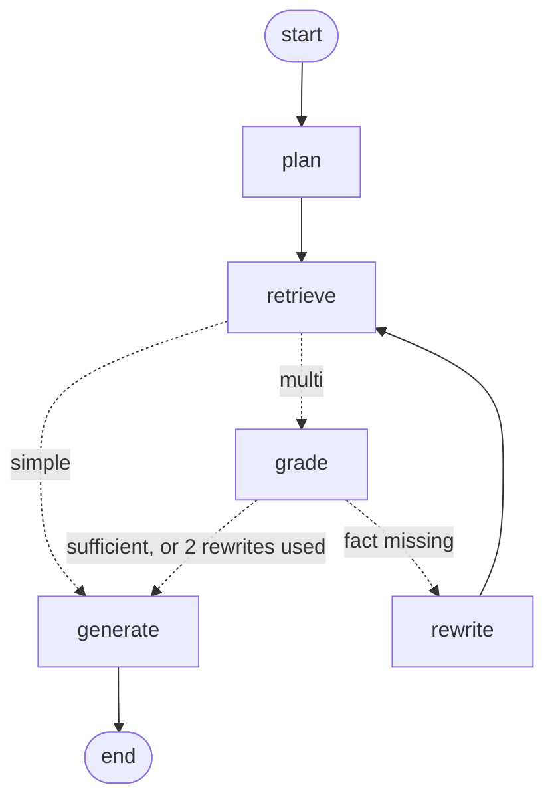

# 🏏 Pitchwise

A Retrieval-Augmented Generation (RAG) assistant that answers cricket
questions — players, formats, tournaments, and the laws of the game —
grounded strictly in a curated knowledge base, not general model knowledge.

Built end-to-end: document ingestion, chunking, embeddings, vector search,
multi-provider LLM generation with automatic fallback, a LangGraph agentic
engine, a FastAPI service and chat interface, and a 104-question evaluation harness that found and fixed a real
grounding gap. Every architectural decision — and every mistake found and
corrected along the way — is dated and reasoned in
[`DECISIONS.md`](./DECISIONS.md).

---

## What it does

Ask a question. Pitchwise retrieves the relevant chunks from its own
knowledge base, generates an answer strictly grounded in that retrieved
context, and shows you exactly which chunks it used — so nothing is a black
box.


If the knowledge base doesn't cover something, Pitchwise says so instead of
guessing — a behavior that was tested for, found to be failing, fixed, and
verified with real data. Details in [`EVAL_RESULTS.md`](./EVAL_RESULTS.md).

---

## Architecture

```
knowledge-base/          17 curated markdown documents
       │
       ▼
   ingest.py              chunk (header-aware) → embed (local, free) → vector store
       │
       ▼
   answer.py               engine="linear":  retrieve → build prompt → generate (multi-provider, with fallback)
       │                   engine="agentic": graph.py (LangGraph) → plan → retrieve → grade → rewrite → generate
       │
       ├──▶ api.py              FastAPI: POST /ask, GET /health, chat UI mounted at /
       ├──▶ app.py              Gradio chat interface (engine toggle + per-answer trace)
       └──▶ evaluation/         104-question eval harness (retrieval + LLM-judge), per-engine runs
```

**Multi-provider by design:** Pitchwise can generate answers via Gemini,
Groq, or OpenRouter — chosen after directly measuring latency across 7
model/provider combinations (Groq came out fastest by a wide margin). If
the selected provider fails or hits a rate limit, it silently falls back to
the next-fastest option rather than surfacing an error. Full reasoning:
[`DECISIONS.md` D-006, D-008](./DECISIONS.md).

---

## v2: Agentic engine (LangGraph)

The evaluation showed exactly where the v1 pipeline falls short: compound
questions (`spanning`) scored **4.1/5**, against 5.0/5 for single facts,
because 4 retrieved chunks often don't hold every fact a comparison needs
([`DECISIONS.md` D-007](./DECISIONS.md)). v2 adds a second engine, built with
**LangGraph**, that plans, checks its own context, and retrieves again when a
fact is missing. Both engines share the same retrieval and the same grounded
prompt, so any difference between them comes from the orchestration.



| Node | LLM call | What it does |
|---|---|---|
| `plan` | 1 | Classifies the question as simple or multi; splits multi questions into 2–3 standalone sub-queries |
| `retrieve` | 0 | Retrieves for the original question first, then each sub-query; removes duplicate chunks; caps at 10 |
| `grade` | 1 | Checks whether the merged context contains every fact the question needs, and names the missing one |
| `rewrite` | 1 | Writes a new search query aimed at the missing fact (at most 2 rewrites) |
| `generate` | 1 | The v1 grounded prompt, unchanged |

Design rules:

- **Simple questions skip grading** (2 LLM calls), protecting the categories
  v1 already answers at 5.0/5.
- **Fail open:** if the planner or grader returns something unparseable, the
  engine falls back to v1 behaviour instead of crashing or guessing.
- **Bounded cost:** at most 2 rewrites, so the worst case is 7 LLM calls.
- **Traceable:** every answer returns a trace (route, sub-queries, rewrites,
  LLM calls, latency, model that answered), shown in the UI and the API.

**Status:** built and covered by offline tests (`tests/`). The 104-question
comparison against the v1 baseline is the next step; results will be added
to [`EVAL_RESULTS.md`](./EVAL_RESULTS.md) once measured. No accuracy claims
for v2 until then.

---

## Evaluation

A 104-question harness across four categories (direct facts, multi-fact
compound questions, temporal/recency questions, and out-of-scope questions
designed to test grounding) — each scored on retrieval quality and answer
quality independently.

The headline result: a real hallucination gap was found through targeted
testing (`out_of_scope` accuracy: **3.3/5**), fixed with a rewritten system
prompt, and the fix was verified **twice, independently** (**5.0/5 in both
runs**).


Full results, methodology, and an honestly-reported side effect of the fix:
**[`EVAL_RESULTS.md`](./EVAL_RESULTS.md)**

---

## Running it

```bash
uv sync                                       # install dependencies

uv run python app.py                          # chat interface (engine toggle in the UI)
uv run uvicorn api:app --port 7860            # FastAPI service + chat UI at http://localhost:7860
                                              # API docs at http://localhost:7860/docs
uv run pytest tests/ -q                       # offline tests (no API keys needed)
uv run python smoke.py                        # live check of both engines on 10 questions
uv run python evaluator.py                    # visual evaluation dashboard
uv run python -m evaluation.eval              # full 104-question run (linear engine)
uv run python -m evaluation.eval --engine agentic --pin-model \
    --results evaluation/results_agentic_r1.jsonl   # agentic run, one model, own results file
```

Ask through the API:

```bash
curl -X POST http://localhost:7860/ask -H "Content-Type: application/json" \
  -d '{"question": "How many overs separate ODI and T20I powerplays?", "engine": "agentic"}'
```

With Docker:

```bash
docker build -t pitchwise .
docker run -p 7860:7860 --env-file .env pitchwise
```

Requires free API keys for Gemini, Groq, and OpenRouter in a `.env` file
(see `.env.example`). All embeddings run locally — no key needed for
ingestion.

---

## Project structure

```
pitchwise/
├── ingest.py              document loading, chunking, embedding, vector store
├── answer.py               retrieval + multi-provider generation; engine switch
├── graph.py                 v2 agentic engine (LangGraph)
├── api.py                   FastAPI service (/ask, /health) + mounted chat UI
├── app.py                   Gradio chat interface
├── smoke.py                 live check of both engines on 10 questions
├── tests/                   offline tests with a scripted fake LLM
├── Dockerfile               container for the API + UI
├── evaluator.py              visual evaluation dashboard
├── knowledge-base/           17 curated markdown documents
├── evaluation/
│   ├── test.py                test question schema + loader
│   ├── eval.py                 retrieval + LLM-judge evaluation logic
│   ├── compare_k.py             retriever k-value comparison tooling
│   └── tests.jsonl               104 test questions
├── DECISIONS.md               every architecture decision, dated and reasoned
└── EVAL_RESULTS.md            evaluation methodology and results, in plain terms
```

---

## Why this exists

Built as a hands-on project to demonstrate practical RAG engineering:
chunking strategy trade-offs, embedding model selection under real
constraints, multi-provider LLM architecture, and — the part most RAG demos
skip — a real evaluation harness that found an actual bug rather than
existing for show.

## Future plans

Pitchwise is presented here as a working, evaluated project — not a
finished product. Concrete next steps, in rough priority order:

- **Measure the agentic engine** — run the 104-question harness on both
  engines in the same week (two agentic runs, one model pinned per run) plus
  a k=8 linear control, and report per-category accuracy, LLM calls and
  latency in [`EVAL_RESULTS.md`](./EVAL_RESULTS.md).
- **A stronger knowledge base** — expand beyond the current 17 curated
  documents with more players, tournaments, and historical depth, and use
  the evaluation harness to verify retrieval quality holds as the knowledge
  base grows (see [`DECISIONS.md`](./DECISIONS.md) D-001 and D-005 for why
  this matters — chunk count and re-embedding cost both scale with content
  size).
- **Live deployment** — the FastAPI + Gradio service is containerised
  (`Dockerfile`); deploying it to a Hugging Face Docker Space is the next
  configuration step (no disk persistence or external embedding API is
  needed — see [`DECISIONS.md`](./DECISIONS.md) D-002, D-005).
- **Retriever `k` tuning** — `evaluation/compare_k.py` is already built to
  test different retriever settings against the specific gap the
  evaluation harness surfaced (see [`EVAL_RESULTS.md`](./EVAL_RESULTS.md)
  and [`DECISIONS.md`](./DECISIONS.md) D-007) — running it to completion
  and applying the result is the most immediate of these next steps.

---
*Author: Somesh Kant Tiwari*