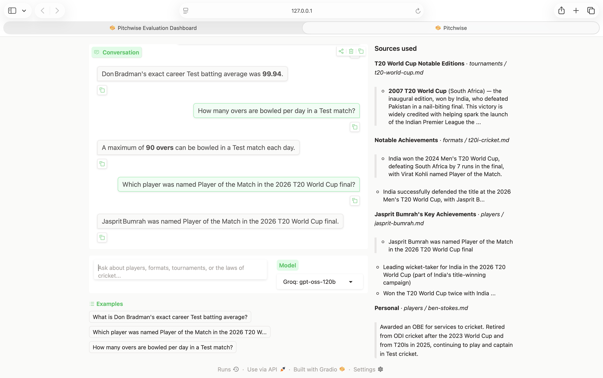
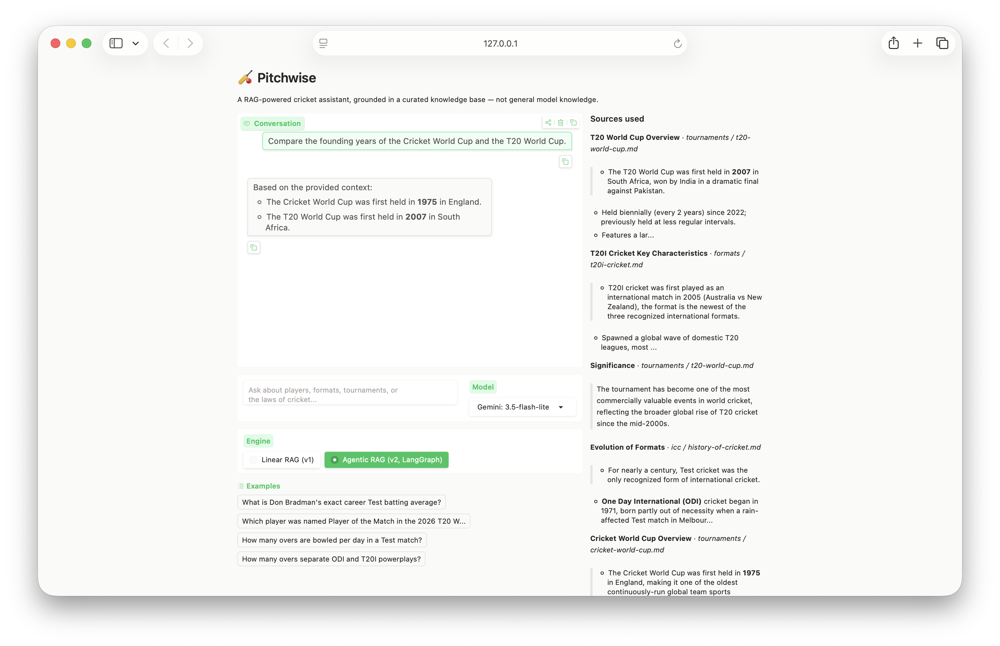
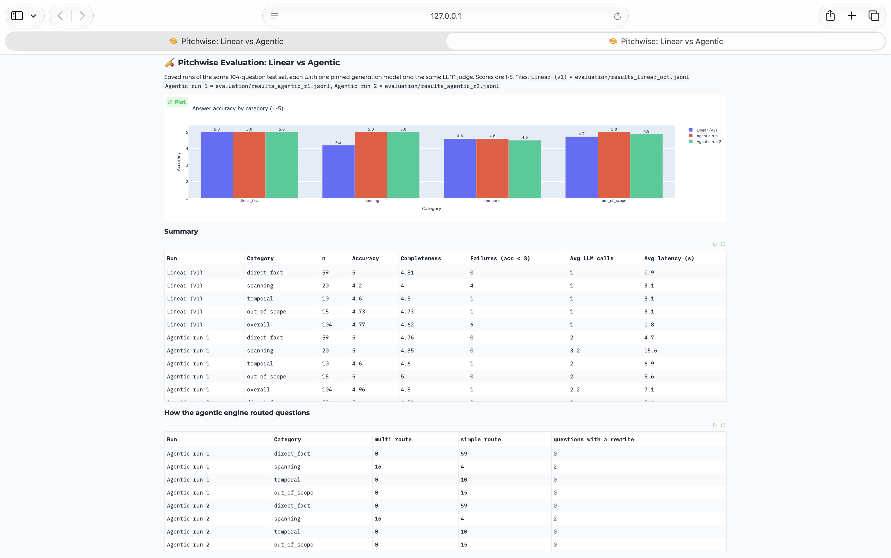
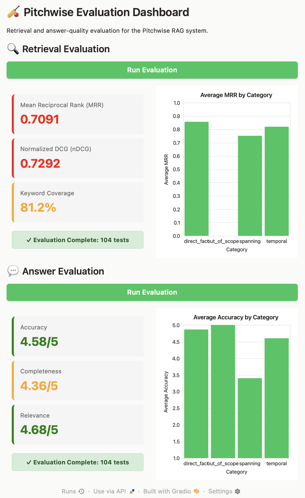

# 🏏 Pitchwise

A Retrieval-Augmented Generation (RAG) assistant that answers cricket
questions — players, formats, tournaments, and the laws of the game —
grounded strictly in a curated knowledge base, not general model knowledge.

Built end-to-end: document ingestion, chunking, embeddings, vector search,
multi-provider LLM generation with automatic fallback, a LangGraph agentic
engine, a FastAPI service and chat interface, and a 104-question evaluation harness that found and fixed a real
grounding gap. Every architectural decision — and every mistake found and
corrected along the way — is dated and reasoned in
[`DECISIONS.md`](./DECISIONS.md).

---

## What it does

Ask a question. Pitchwise retrieves the relevant chunks from its own
knowledge base, generates an answer strictly grounded in that retrieved
context, and shows you exactly which chunks it used — so nothing is a black
box.



If the knowledge base doesn't cover something, Pitchwise says so instead of
guessing — a behavior that was tested for, found to be failing, fixed, and
verified with real data. Details in [`EVAL_RESULTS.md`](./EVAL_RESULTS.md).

---

## Architecture

```
knowledge-base/          17 curated documents + 132 Wikipedia articles (about 3,100 chunks)
       │
       ▼
   ingest.py              chunk (header-aware) → embed (local, free) → vector store
       │
       ▼
   answer.py               engine="linear":  retrieve → build prompt → generate (multi-provider, with fallback)
       │                   engine="agentic": graph.py (LangGraph) → plan → retrieve → grade → rewrite → generate
       │
       ├──▶ api.py              FastAPI: POST /ask, GET /health, chat UI mounted at /
       ├──▶ app.py              Gradio chat interface (engine toggle + per-answer trace)
       └──▶ evaluation/         104-question eval harness (retrieval + LLM-judge), per-engine runs
```

**Multi-provider by design:** Pitchwise can generate answers via Gemini,
Groq, or OpenRouter — chosen after directly measuring latency across 7
model/provider combinations (Groq came out fastest by a wide margin). If
the selected provider fails or hits a rate limit, it silently falls back to
the next-fastest option rather than surfacing an error. Full reasoning:
[`DECISIONS.md` D-006, D-008](./DECISIONS.md).

---

## v2: Agentic engine (LangGraph)

The evaluation showed exactly where the v1 pipeline falls short: compound
questions (`spanning`) scored **4.1/5** in the September v1 run, against 5.0/5 for single facts,
because 4 retrieved chunks often don't hold every fact a comparison needs
([`DECISIONS.md` D-007](./DECISIONS.md)). v2 adds a second engine, built with
**LangGraph**, that plans, checks its own context, and retrieves again when a
fact is missing. Both engines share the same retrieval and the same grounded
prompt, so any difference between them comes from the orchestration.



The trace shown under the sources for that answer:

```
Engine: agentic   Route: multi   Rewrites: 0   LLM calls: 3   Latency: 5009 ms
Search queries: Cricket World Cup founding year, T20 World Cup founding year
Steps: plan:multi(2) -> retrieve:3q/10chunks -> grade:ok -> generate
```


| Node | LLM call | What it does |
|---|---|---|
| `plan` | 1 | Classifies the question as simple or multi; splits multi questions into 2–3 standalone sub-queries |
| `retrieve` | 0 | Retrieves for the original question first, then each sub-query; removes duplicate chunks; caps at 10 |
| `grade` | 1 | Checks whether the merged context contains every fact the question needs, and names the missing one |
| `rewrite` | 1 | Writes a new search query aimed at the missing fact (at most 2 rewrites) |
| `generate` | 1 | The v1 grounded prompt, unchanged |

Design rules:

- **Simple questions skip grading** (2 LLM calls), protecting the categories
  v1 already answers at 5.0/5.
- **Fail open:** if the planner or grader returns something unparseable, the
  engine falls back to v1 behaviour instead of crashing or guessing.
- **Bounded cost:** at most 2 rewrites, so the worst case is 7 LLM calls.
- **Traceable:** every answer returns a trace (route, sub-queries, rewrites,
  LLM calls, latency, the model that answered and the model that routed,
  tokens and list-price cost), shown in the UI and the API.

**Measured:** on the 104-question harness, with the answer model pinned per
run, `spanning` accuracy went from **4.2/5** (October linear baseline) to **5.0/5** in **both**
agentic runs, while `direct_fact` stayed at 5.0/5. Of the 4 linear failures
it fixed, 3 came from retrieval (final-context keyword coverage 0-50% to
100%); the 4th was model variance. It averages 2.2 LLM calls per question
against 1 for linear. A k=8 linear control was planned but not run, so the
comparison is against the default k=4. Full table, failures and method:
[`EVAL_RESULTS.md`](./EVAL_RESULTS.md).



---

## Cost, tokens and tracing

Every LLM call records its input and output tokens, latency and list-price
cost, taken from the provider's own usage report
([`DECISIONS.md` D-012](./DECISIONS.md)). Each answer's trace shows the
totals and a per-step breakdown (plan, grade, rewrite, generate), and every
evaluation row stores them, with the judge's cost kept separate.
`evaluation/compare_runs.py` turns them into tokens and cost per question,
per 1,000 questions, per month at 10,000 questions a day, and per correct
answer, plus the share of tokens each agentic step uses. Pitchwise itself
runs on free tiers; list prices answer what it would cost on a paid plan.

With Langfuse keys in `.env`, every question is also traced in
[Langfuse](https://langfuse.com): one trace per question with a span per
graph node, each search's query and results, and each LLM call's prompt,
output, tokens and cost ([`DECISIONS.md` D-013](./DECISIONS.md)). Without
keys, tracing is off and nothing else changes.

---

## Evaluation

A 104-question harness across four categories (direct facts, multi-fact
compound questions, temporal/recency questions, and out-of-scope questions
designed to test grounding) — each scored on retrieval quality and answer
quality independently.

The headline result: a real hallucination gap was found through targeted
testing (`out_of_scope` accuracy: **3.3/5**), fixed with a rewritten system
prompt, and the fix was verified **twice, independently** (**5.0/5 in both
runs**).



Full results, methodology, and an honestly-reported side effect of the fix:
**[`EVAL_RESULTS.md`](./EVAL_RESULTS.md)**

---

## Running it

```bash
uv sync                                       # install dependencies

uv run python app.py                          # chat interface (engine toggle in the UI)
uv run uvicorn api:app --port 7860            # FastAPI service + chat UI at http://localhost:7860
                                              # API docs at http://localhost:7860/docs
uv run pytest tests/ -q                       # offline tests (no API keys needed)
uv run python smoke.py                        # live check of both engines on 10 questions
uv run python evaluator.py                    # visual evaluation dashboard
uv run python -m evaluation.eval --pin-model \
    --results evaluation/results_linear_new.jsonl   # linear run, one model, its own results file
uv run python -m evaluation.eval --engine agentic --pin-model \
    --results evaluation/results_agentic_new.jsonl  # agentic run, one model, its own results file
# Each run needs a new --results file: an existing file is resumed, not overwritten.
uv run python -m evaluation.mechanism         # keyword coverage of the agentic engine's final context
uv run python scripts/build_kb.py             # fetch the Wikipedia part of the knowledge base (needs internet)
uv run python -m evaluation.build_tests_v3    # rebuild the v3 test set and check every keyword
uv run python -m evaluation.eval --tests evaluation/tests_v3.jsonl --engine agentic --pin-model \
    --results evaluation/results_v3_agentic_r1.jsonl   # a v3 run
uv run python -m evaluation.compare_runs      # dashboard comparing saved runs, no LLM calls
```

Ask through the API:

```bash
curl -X POST http://localhost:7860/ask -H "Content-Type: application/json" \
  -d '{"question": "Compare the founding years of the Cricket World Cup and the T20 World Cup.", "engine": "agentic"}'
```

With Docker:

```bash
docker build -t pitchwise .
docker run -p 7860:7860 --env-file .env pitchwise
```

Requires free API keys for Gemini, Groq, and OpenRouter in a `.env` file
(see `.env.example`). All embeddings run locally — no key needed for
ingestion.

---

## Project structure

```
pitchwise/
├── ingest.py              document loading, chunking, embedding, vector store
├── answer.py               retrieval + multi-provider generation; engine switch
├── graph.py                 v2 agentic engine (LangGraph)
├── usage.py                 token and cost accounting for every LLM call
├── observability.py         optional Langfuse tracing (no-op without keys)
├── api.py                   FastAPI service (/ask, /health) + mounted chat UI
├── app.py                   Gradio chat interface
├── smoke.py                 live check of both engines on 10 questions
├── tests/                   offline tests with scripted fake LLMs and providers
├── Dockerfile               container for the API + UI
├── evaluator.py              visual evaluation dashboard
├── knowledge-base/           curated documents, plus wikipedia/ built by scripts/build_kb.py
├── scripts/build_kb.py       fetches and converts the Wikipedia articles (D-014)
├── evaluation/
│   ├── test.py                test question schema + loader
│   ├── eval.py                 retrieval + LLM-judge evaluation logic
│   ├── compare_k.py             retriever k-value comparison tooling
│   ├── mechanism.py             final-context keyword coverage for the agentic engine
│   ├── compare_runs.py          dashboard comparing saved evaluation runs
│   ├── results_*.jsonl          saved runs: linear baseline and two agentic runs
│   ├── build_tests_v3.py        builds and checks the v3 test set
│   ├── tests_v3.jsonl           177 questions for the expanded knowledge base
│   └── tests.jsonl               104 test questions (v2, frozen)
├── DECISIONS.md               every architecture decision, dated and reasoned
└── EVAL_RESULTS.md            evaluation methodology and results, in plain terms
```

---

## Why this exists

Built as a hands-on project to demonstrate practical RAG engineering:
chunking strategy trade-offs, embedding model selection under real
constraints, multi-provider LLM architecture, and — the part most RAG demos
skip — a real evaluation harness that found an actual bug rather than
existing for show.

## Future plans

Pitchwise is presented here as a working, evaluated project — not a
finished product. Concrete next steps, in rough priority order:

- **Re-baseline on the v3 knowledge base** — run both engines on the
  177-question v3 test set against the expanded knowledge base (D-014),
  with token and cost accounting on (D-012), and report what scale did to
  retrieval, grounding and cost.
- **Detect contradictions automatically** — C-007 was found by reading:
  check the knowledge base for conflicting claims about the same subject.
- **A stronger knowledge base** — expand beyond the current 17 curated
  documents with more players, tournaments, and historical depth, and use
  the evaluation harness to verify retrieval quality holds as the knowledge
  base grows (see [`DECISIONS.md`](./DECISIONS.md) D-001 and D-005 for why
  this matters — chunk count and re-embedding cost both scale with content
  size).
- **Live deployment** — the FastAPI + Gradio service is containerised
  (`Dockerfile`); deploying it to a Hugging Face Docker Space is the next
  configuration step (no disk persistence or external embedding API is
  needed — see [`DECISIONS.md`](./DECISIONS.md) D-002, D-005).
- **The k=8 control** — check whether simply retrieving more chunks matches
  the agentic engine on `spanning` at about a third of the LLM calls.
  `evaluation/compare_k.py` already runs the `spanning` questions at k=4, 6
  and 8; it needs the same model pinning as the main eval before its numbers
  are comparable ([`DECISIONS.md`](./DECISIONS.md) D-007, D-009).

---
*Author: Somesh Kant Tiwari*